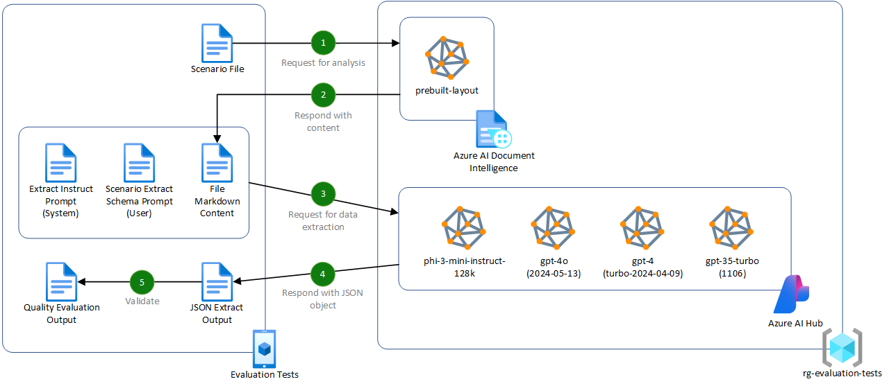
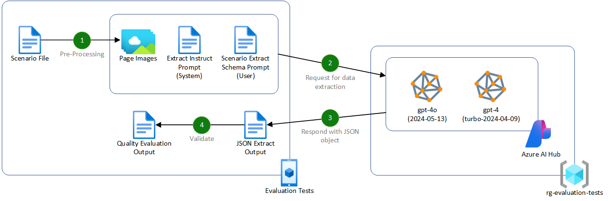

# Evaluating the quality of AI document data extraction with small and large language models

This repository contains the code and data used in the analysis write-up on ["Evaluating the quality of AI document data extraction with small and large language models](https://techcommunity.microsoft.com/t5/azure-for-isv-and-startups/evaluating-the-quality-of-ai-document-data-extraction-with-small/ba-p/4157719) published on the Microsoft Tech Community Blog by the ISV & Digital Native Center of Excellence team.

The repository provides a .NET NUnit test project demonstrates the following techniques for data extraction using small and large language models:

- **Markdown Extraction with Azure AI Document Intelligence.** This technique involves converting the document into Markdown using the pre-built layout model in Azure AI Document Intelligence. Read more about this technique in our detailed article.
- **Vision Capabilities of Multi-Modal Language Models.** This technique focuses on GPT-4 Turbo and Omni models by converting the document pages to images. This leverages the models' capabilities to analyze both text and visual elements. Explore this technique in more detail in our sample project.

For each technique, the model is prompted using a [one-shot technique](https://learn.microsoft.com/en-us/ai/playbook/technology-guidance/generative-ai/working-with-llms/prompt-engineering), providing the expected output schema for the response. This establishes the intention, improving the overall accuracy of the generated output.

## Pre-requisites - Understanding

Before exploring this repository in detail, please ensure that you have a level of understanding of the following:

### .NET Testing

- [Testing in .NET](https://learn.microsoft.com/en-us/dotnet/core/testing/)

### Azure AI

- [Understanding Azure OpenAI models](https://learn.microsoft.com/en-us/azure/ai-services/openai/concepts/models)
- [Awareness of small language models (SLMs), such as Phi-3](https://azure.microsoft.com/en-gb/products/phi-3/)
- [Using Azure AI Document Intelligence and Azure OpenAI to extract structured data from documents](https://techcommunity.microsoft.com/t5/azure-for-isv-and-startups/using-azure-ai-document-intelligence-and-azure-openai-to-extract/ba-p/4107746)
- [Using Azure OpenAI GPT-4 with Vision models to extract structured data from documents](https://github.com/Azure-Samples/azure-openai-gpt-4-vision-pdf-extraction-sample)
- [Evaluation of generative AI applications](https://learn.microsoft.com/en-us/azure/ai-studio/concepts/evaluation-approach-gen-ai)

## Pre-requisites - Setup

Before running the tests, you will need to have the following:

- An Azure subscription. If you don't have an Azure subscription, create an [account](https://azure.microsoft.com/en-us/).
- [PowerShell Core](https://docs.microsoft.com/en-us/powershell/scripting/install/installing-powershell?view=powershell-7.1).
- [Azure CLI](https://docs.microsoft.com/en-us/cli/azure/install-azure-cli).
- [.NET 8 SDK](https://dotnet.microsoft.com/download).
- [Visual Studio](https://visualstudio.microsoft.com/) or [Visual Studio Code](https://code.visualstudio.com/).
  - If using Visual Studio Code, recommended extensions are provided in the [.vscode/extensions.json](./.vscode/extensions.json) file.

## Understanding the evaluation tests

The purpose of this repository is to provide a demonstration to how you can effectively evaluate different language models and techniques for document data extraction. The test cases for each scenario create a consistent evaluation framework for each technique and model combination, providing results that can be clearly compared.

### Evaluating the Markdown technique with Azure AI Document Intelligence



> **Test Scenario:** The test scenario evaluates the quality of data extraction using the Markdown technique with Azure AI Document Intelligence and prompting language models for JSON structures.

For this technique, the test runs as follows:

1. The scenario PDF document is loaded into sent to the Azure AI Document Intelligence service for processing using the `prebuilt-layout` model.
   > _See [AzureAIDocumentIntelligenceMarkdownConverter.cs](./test/EvaluationTests/Shared/Markdown/AzureAIDocumentIntelligenceMarkdownConverter.cs) for more details on calling this API endpoint using the Azure AI Document Intelligence .NET SDK._
2. The extracted Markdown content is then passed back, being constructed into a request to a language model combined with a system and scenario extract prompts used to perform the data extraction.
   > _The details for the specific system and extract prompts are defined in the test cases for consistency across each model and technique. As part of the scenario extract prompt, a one-shot example is provided (see [InvoiceData.cs](./test/EvaluationTests/Assets/Invoices/InvoiceData.cs)). For detail on the test case constructions, see [InvoiceDataExtractionTests.cs](./test/EvaluationTests/InvoiceDataExtractionTests.cs) for more details._
3. With this construct, the request is made to the language model.
   > _See [AzureMLServerlessMarkdownDocumentDataExtractor.cs](./test/EvaluationTests/Shared/Extraction/AzureML/AzureMLServerlessMarkdownDocumentDataExtractor.cs) and [AzureOpenAIMarkdownDocumentDataExtractor.cs](./test/EvaluationTests/Shared/Extraction/AzureOpenAI/AzureOpenAIMarkdownDocumentDataExtractor.cs) for more details on how the request is made._
4. The JSON response is then deserialized into the same .NET object that was used to construct the request.
   > _As an example, see [InvoiceData.cs](./test/EvaluationTests/Assets/Invoices/InvoiceData.cs) for the object structure._
5. Based on the expected output, determined by the test case, the actual output is compared to the expected output. The test then stores the quality results, including the accuracy, execution time, and tokens used.
   > _See [InvoiceDataExtractionTests.cs](./test/EvaluationTests/InvoiceDataExtractionTests.cs) for more details on the test case construction and evaluation._

### Evaluating the Vision technique with Multi-Modal Language Models



> **Test Scenario:** The test scenario evaluates the quality of data extraction using the Vision technique with Multi-Modal Language Models with a single prompt request for JSON structures.

For this technique, the test runs as follows:

1. The scenario PDF document is loaded, and each page is converted to an image. The page images are then constructed into a request to a vision capable language model combined with a system and scenario extract prompts used to perform the data extraction.

   > _The details for the specific system and extract prompts are defined in the test cases for consistency across each model and technique. As part of the scenario extract prompt, a one-shot example is provided (see [VehicleInsuranceContractData.cs](./test/EvaluationTests/Assets/Contracts/VehicleInsuranceContractData.cs)). For detail on the test case constructions, see [VehicleInsuranceContractDataExtractionTests.cs](./test/EvaluationTests/VehicleInsuranceContractDataExtractionTests.cs) for more details._

> [!IMPORTANT]
> The GPT-4 with Vision models only support 10 images, so the test performs pre-processing on documents over this limit. This is achieved by stitching pages together to reduce the number of total images to the maximum supported.
> _See [AzureOpenAIVisionDocumentDataExtractor.cs](./test/EvaluationTests/Shared/Extraction/AzureOpenAI/AzureOpenAIVisionDocumentDataExtractor.cs) for more details on how the images are processed._

2. With this construct, the request is made to the language model.
   > _See [AzureOpenAIVisionDocumentDataExtractor.cs](./test/EvaluationTests/Shared/Extraction/AzureOpenAI/AzureOpenAIVisionDocumentDataExtractor.cs) for more details on how the request is made._
3. The JSON response is then deserialized into the same .NET object that was used to construct the request.
   > _As an example, see [VehicleInsuranceContractData.cs](./test/EvaluationTests/Assets/Contracts/VehicleInsuranceContractData.cs) for the object structure._
4. Based on the expected output, determined by the test case, the actual output is compared to the expected output. The test then stores the quality results, including the accuracy, execution time, and tokens used.
   > _See [VehicleInsuranceContractDataExtractionTests.cs](./test/EvaluationTests/VehicleInsuranceContractDataExtractionTests.cs) for more details on the test case construction and evaluation._

## Project structure

The project structure is as follows:

- **[EvaluationTests](./test/EvaluationTests)**: The main test project containing the scenarios, test cases, and documents for processing.
  - **[Structured (Invoices)](./test/EvaluationTests/InvoiceDataExtractionTests.cs)**: Contains the test cases for extracting data from structured documents, in this case, invoices. The test cases evaluate two sub-scenarios: one for a simple invoice that contains typed data and signatures, and another for a more complex invoice that contains a grid system to separate the data, handwritten text, and content overlapping.
  - **[Unstructured (Vehicle Insurance Contracts)](./test/EvaluationTests/VehicleInsuranceContractDataExtractionTests.cs)**: Contains the test cases for extracting data from unstructured documents, in this case, vehicle insurance contracts. The tests aim to extract data that can only be inferred from the content and structure of the document. For example, the [VehicleInsuranceContractData.cs](./test/EvaluationTests/Assets/Contracts/VehicleInsuranceContractData.cs) object expects to extract a **Last Date To Cancel** which is not explicitly stated in the document. The expectation is that the language model will infer natural language, such as _"You have the right to cancel this policy within the first 14 days"_ and extract the date based on the effective start date, which is known.
- **[Shared](./test/EvaluationTests/Shared)**: Contains reusable .NET services that can be used in projects, including the document data extractor services for Azure OpenAI and Azure AI Document Intelligence.
- **[Infra](./infra/main.bicep)**: Contains the Azure Bicep template for deploying the necessary Azure services for the tests.

## Running the tests

To run the tests, you must setup the necessary Azure services and configure the test project with the required environment variables. To setup an environment in Azure, simply run the [Setup-Environment.ps1](./Setup-Environment.ps1) script from the root of the project:

```powershell
.\Setup-Environment.ps1 -DeploymentName <DeploymentName> -Location <Location> -SkipInfrastructure $false
```

This script will deploy the necessary Azure services using the Azure Bicep template in the [infra](./infra/main.bicep) folder.

Once deployed, the script will also update the [appsettings.Test.json](./test/EvaluationTests/appsettings.Test.json) file with the necessary connection strings and keys for the Azure services. You can then run the tests using the following command:

```powershell
dotnet test
```

### Understanding the test results

For each of the scenarios run, files will be output in the `bin/Debug/net8.0/Output` folder for the project.

These files contain:

- **Accuracy**: The results of the comparison between the expected and actual output. Most property values will be 0 or 1, with 1 indicating a match. Objects and arrays will have a rollup accuracy based on the number of properties that matched. The overall accuracy is calculated as the sum of the property accuracies divided by the total number of properties.
- **Execution Time**: The time taken to execute the data extraction. This starts when the first request is made to either the Azure AI Document Intelligence or Azure OpenAI service and ends when the extracted data response is received.
- **Result**: The extracted data response from the language model, including the total tokens used in both the prompt and response.
